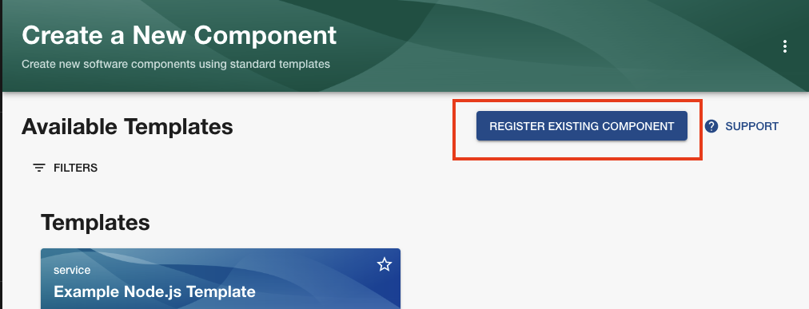

# How to disable the Register Existing Component button

## Overview

This is a tutorial on how to disable the `Register Existing Component` button
on the Create a New Component page:



The general steps are:

1. Enable Backstage's authorization framework
1. Create a policy which denies `catalog.entity.create`
1. Wire up the policy

## Background

By default, the existing `Register Existing Component` button is wrapped in
a [conditional](https://github.com/backstage/backstage/blob/master/plugins/scaffolder/src/components/ScaffolderPage/ScaffolderPage.tsx#L96-L101):

```ts
{
  allowed && (
    <CreateButton
      title="Register Existing Component"
      to={registerComponentLink && registerComponentLink()}
    />
  );
}
```

Digging further, we can see that `allowed` is set as [follows](https://github.com/backstage/backstage/blob/master/plugins/scaffolder/src/components/ScaffolderPage/ScaffolderPage.tsx#L80-L82):

```ts
const { allowed } = usePermission({
  permission: catalogEntityCreatePermission,
});
```

Thus, if `catalogEntityCreatePermission` returns true, then `allowed` is true
and the button is rendered.

For this tutorial, our goal is to disallow the ability to create a new entity
thereby hiding / disabling that functionality.

## Enable Backstage's authorization framework

First, we have to enable Backstage's authorization framework.

1. Edit `app-config.yaml` and add `permission.enabled` and set that to `true`

   ```yaml
   permission:
     enabled: true
   ```

   By default, this setting is not present and you'll have to add that to
   your configuration.

   When set to `true`, this instructs the framework to send authorization
   requests.

1. The next step is to un-comment / enable the `backend.auth.keys` section.

   ```yaml
   auth:
     keys:
       - secret: ${BACKEND_SECRET}
   ```

   Enabling this section, allows backend plugins to be able to talk to one
   another when `permission.enabled` is `true`. This allows backends to be
   able to identify whether the request is coming from a user or another
   backend.

   We will set `${BACKEND_SECRET}` later.

1. We also need to install the `@backstage/plugin-permission-backend` module
   in the `packages/backend` folder

   ```bash
   yarn --cwd packages/backend add @backstage/plugin-permission-backend
   ```

## Create policy

Once the prerequisites are in place, we need to create a policy which will
disallow or DENY the ability to create new entities.

### Deny catalog.entity.create

If one does not already exist, create `packages/backend/src/plugins/permission.ts`
with the following contents:

```typescript
// Original https://github.com/backstage/backstage/blob/master/packages/backend/src/plugins/permission.ts

import { BackstageIdentityResponse } from '@backstage/plugin-auth-node';
import { createRouter } from '@backstage/plugin-permission-backend';
import {
  AuthorizeResult,
  PolicyDecision,
} from '@backstage/plugin-permission-common';
import {
  PermissionPolicy,
  PolicyQuery,
} from '@backstage/plugin-permission-node';

import { Router } from 'express';
import { PluginEnvironment } from '../types';

class DemoPolicy implements PermissionPolicy {
  async handle(
    request: PolicyQuery,
    user?: BackstageIdentityResponse,
  ): Promise<PolicyDecision> {
    if (request.permission.name === 'catalog.entity.create') {
      return {
        result: AuthorizeResult.DENY,
      };
    }

    // Default behavior
    return {
      result: AuthorizeResult.ALLOW,
    };
  }
}

export default async function createPlugin(
  env: PluginEnvironment,
): Promise<Router> {
  return await createRouter({
    config: env.config,
    logger: env.logger,
    discovery: env.discovery,
    policy: new DemoPolicy(),
    identity: env.identity,
  });
}
```

This policy is called `DemoPolicy` and by default, we will `ALLOW` any
permission (the existing default behavior).

However, if the requested permission name is `catalog.entity.create`,
we will `DENY` that request.

## Wire it up

After the policy has been created, Backstage needs to know what to do when
a request is made.

1. Edit `packages/backend/src/index.ts`

1. Import the policy we just created

   ```typescript
   import permission from './plugins/permission';
   ```

1. In the `makeCreateEnv` function, replace `ServerTokenManager.noop()` with
   something that will actually generate tokens:

   ```typescript
   // BEFORE
   const tokenManager = ServerTokenManager.noop();

   // AFTER
   const tokenManager = ServerTokenManager.fromConfig(config, { logger: root });
   ```

1. In the `main` function:

   1. First create an environment for our permission:

      ```typescript
      const permissionEnv = useHotMemoize(module, () =>
        createEnv('permission'),
      );
      ```

   1. Add that environment to the list of routes:

      ```typescript
      apiRouter.use('/permission', await permission(permissionEnv));
      ```

Review your changes, your diff should look similar to the following:

```diff
 import proxy from './plugins/proxy';
 import techdocs from './plugins/techdocs';
 import search from './plugins/search';
+import permission from './plugins/permission';
 import { PluginEnvironment } from './types';
 import { ServerPermissionClient } from '@backstage/plugin-permission-node';
 import { DefaultIdentityClient } from '@backstage/plugin-auth-node';
@@ -38,7 +39,7 @@ function makeCreateEnv(config: Config) {
   const discovery = SingleHostDiscovery.fromConfig(config);
   const cacheManager = CacheManager.fromConfig(config);
   const databaseManager = DatabaseManager.fromConfig(config, { logger: root });
-  const tokenManager = ServerTokenManager.noop();
+  const tokenManager = ServerTokenManager.fromConfig(config, { logger: root });
   const taskScheduler = TaskScheduler.fromConfig(config);

   const identity = DefaultIdentityClient.create({
@@ -81,6 +82,7 @@ async function main() {
   const catalogEnv = useHotMemoize(module, () => createEnv('catalog'));
   const scaffolderEnv = useHotMemoize(module, () => createEnv('scaffolder'));
   const authEnv = useHotMemoize(module, () => createEnv('auth'));
+  const permissionEnv = useHotMemoize(module, () => createEnv('permission'));
   const proxyEnv = useHotMemoize(module, () => createEnv('proxy'));
   const techdocsEnv = useHotMemoize(module, () => createEnv('techdocs'));
   const searchEnv = useHotMemoize(module, () => createEnv('search'));
@@ -91,6 +93,7 @@ async function main() {
   apiRouter.use('/scaffolder', await scaffolder(scaffolderEnv));
   apiRouter.use('/auth', await auth(authEnv));
   apiRouter.use('/techdocs', await techdocs(techdocsEnv));
+  apiRouter.use('/permission', await permission(permissionEnv));
   apiRouter.use('/proxy', await proxy(proxyEnv));
   apiRouter.use('/search', await search(searchEnv));
```

## Validate changes

1. Before starting the server, set a secret for `BACKEND_SECRET`.
   For example:

   ```bash
   export BACKEND_SECRET=123abcde
   ```

1. Start up the server

   ```bash
   yarn dev
   ```

1. Navigate to Create and confirm that the button no longer shows up.
