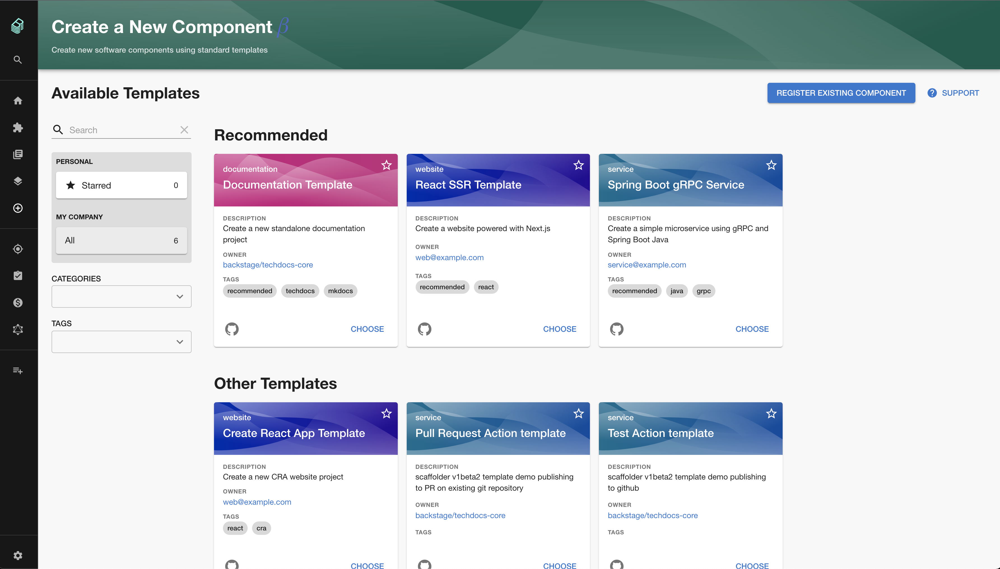

Backstage software templates create source code, so your Backstage application
needs to be set up to allow repository creation.

This is done in your `app-config.yaml` by adding
[Backstage integrations](https://backstage.io/docs/integrations/) for the
appropriate source code repository for your organization.

> Note: Integrations may already be set up as part of your `app-config.yaml`.

The next step is to [add templates](http://backstage.io/docs/features/software-templates/adding-templates)
to your Backstage app.

## Publishing defaults

Software templates can define _publish_ actions, such as `publish:github`, to
create new repositories or submit pull / merge requests to existing
repositories. You can configure the author and commit message through the
`scaffolder` configuration in `app-config.yaml`:

```yaml
scaffolder:
  defaultAuthor:
    name: M.C. Hammer # Defaults to `Scaffolder`
    email: hammer@donthurtem.com # Defaults to `scaffolder@backstage.io`
  defaultCommitMessage: "U can't touch this" # Defaults to 'Initial commit'
```

To configure who can see the new repositories created from software templates,
add the `repoVisibility` key within a software template:

```yaml
- id: publish
  name: Publish
  action: publish:github
  input:
    repoUrl: '{{ parameters.repoUrl }}'
    repoVisibility: public # or 'internal' or 'private'
```

## Disabling Docker in Docker situation (Optional)

Software templates use the `fetch:template` action by default, which requires no
external dependencies and offers a
[Cookiecutter-compatible mode](https://backstage.io/docs/features/software-templates/builtin-actions#using-cookiecuttercompat-mode).
There is also a `fetch:cookiecutter` action, which uses
[Cookiecutter](https://github.com/cookiecutter/cookiecutter) directly for
templating. By default, the `fetch:cookiecutter` action will use the
[scaffolder-backend/Cookiecutter](https://github.com/backstage/backstage/blob/master/plugins/scaffolder-backend/scripts/Cookiecutter.dockerfile)
docker image.

If you are running Backstage from a Docker container and you want to avoid
calling a container inside a container, you can set up Cookiecutter in your own
image, this will use the local installation instead.

You can do so by including the following lines in the last step of your
`Dockerfile`:

```Dockerfile
RUN apt-get update && apt-get install -y python3 python3-pip
RUN pip3 install cookiecutter
```

## Customizing the ScaffolderPage with Grouping and Filtering

Once you have more than a few software templates you may want to customize your
`ScaffolderPage` by grouping and surfacing certain templates together. You can
accomplish this by creating `groups` and passing them to your `ScaffolderPage`
like below

```
<ScaffolderPage
  groups={[
    {
      title: "Recommended",
      filter: entity =>
        entity?.metadata?.tags?.includes('recommended') ?? false,
    },
  ]}
/>
```

This code will group all templates with the 'recommended' tag together at the
top of the page above any other templates not filtered by this group or others.

You can also further customize groups by passing in a `titleComponent` instead
of a `title` which will be a component to use as the header instead of just the
default `ContentHeader` with the `title` set as it's value.


## Hiding the templates under a feature flag

If you would like to develop a template but not to make it visible to all user yet, you can place it under
feature flag. Your template has to contain an "experimental" tag.

To make experimental templates visible you have to enable a feature flag "experimental-scaffolder-templates" in
"Settings -> Feature Flags" panel.
