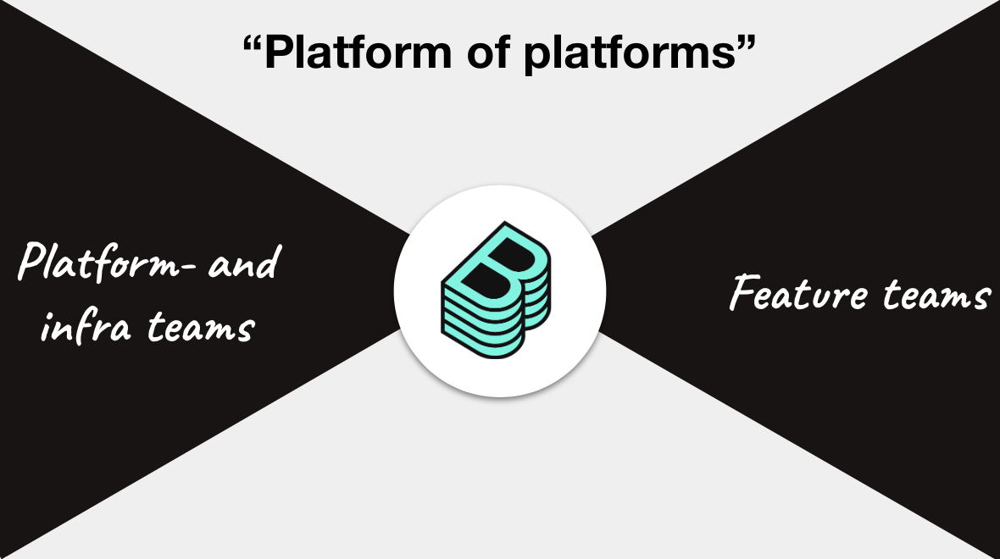

This document outlines some general best practices that have been key to
Backstage's success inside Spotify. Every organization is different and some of
these learnings will therefore not be applicable for your company. We are hoping
that this can become a living document, and strongly encourage you to contribute
back whatever learnings you gather while adopting Backstage inside your company.

## Organizational setup

The true value of Backstage is unlocked when it becomes _THE_ developer portal
at your company. As such it is important to recognize that you will need a
central team that owns your Backstage deployment and treats it like a product.

This team will have three primary objectives:

1. Maintain and operate your deployment of Backstage. This includes customer
   support, infrastructure, CI/CD and, as your Backstage product evolves,
   on-call support.

2. Drive adoption of customers (developers at your company).

3. Work with senior tech leadership and architects to ensure your organizations
   best practices for software development are encoded into your
   [Software Templates](../features/software-templates/index.md).

4. Evangelize Backstage as a central platform to other infrastructure/platform
   teams.

## Internal evangelization

The third aspect deserves more attention, since it is the least obvious success
factor, but also the most critical.

## Metrics

- 🐣 **Phase 1:** Extensible frontend platform (Done ✅) - You will be able to
  easily create a single consistent UI layer for your internal infrastructure
  and tools. A set of reusable
  [UX patterns and components](https://backstage.io/storybook) help ensure a
  consistent experience between tools.

- 🐢 **Phase 2:** Service Catalog
  ([alpha released](https://backstage.io/blog/2020/06/22/backstage-service-catalog-alpha)) -
  With a single catalog, Backstage makes it easy for a team to manage ten
  services — and makes it possible for your company to manage thousands of them.

- 🐇 **Phase 3:** Ecosystem (later) - Everyone's infrastructure stack is
  different. By fostering a vibrant community of contributors we hope to provide
  an ecosystem of Open Source plugins/integrations that allows you to pick the
  tools that match your stack.
