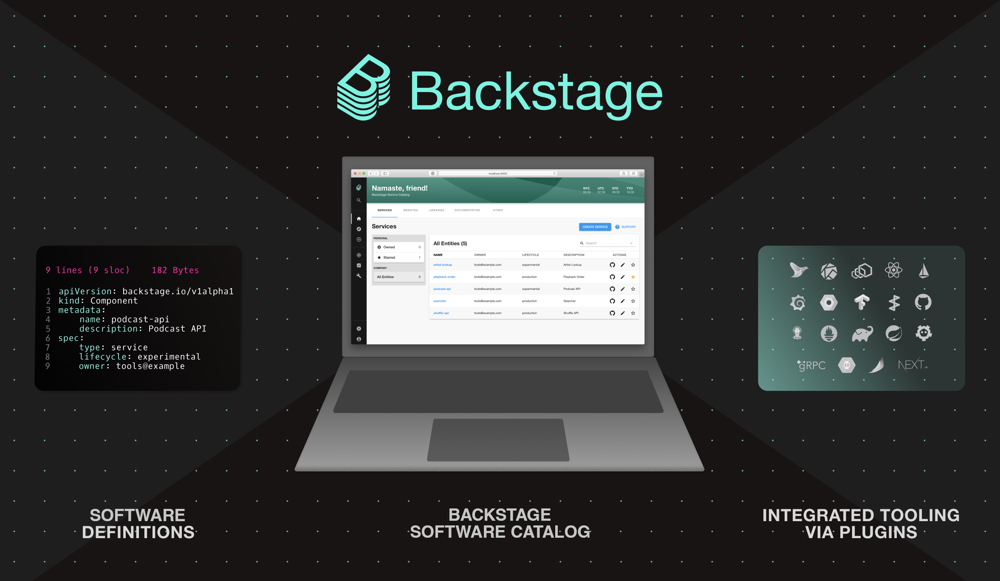

[Backstage](https://backstage.io/) is an open source framework for building developer
portals. Powered by a centralized software catalog, Backstage restores order to
your microservices and infrastructure and enables your product teams to ship
high-quality code quickly — without compromising autonomy.

There is no universally accepted definition for a developer portal, but let's attempt to establish a clear concept. A developer portal can be described as a centralized hub that consolidates tools and resources essential for software development teams to maintain productivity. The primary goal is to minimize context switching and cognitive load while promoting self service, thereby enabling teams to remain in a state of flow as consistently as possible. Although it's termed a 'developer portal,' its purpose extends beyond individual developers, encompassing all roles involved in the software development lifecycle. Ultimately, the objective is to enhance the developer experience which, in turn, benefits the entire software development team by fostering a more collaborative and efficient environment.

However, Backstage itself is not a one-size-fits-all developer portal, instead, it provides a toolkit enabling organizations to build their own unique portals tailored to their specific needs. This customization is key because organizational structures and processes vary widely. Backstage offers an open-source foundation adaptable by any adopter, supporting diverse requirements and workflows.

<iframe width="672" height="378" src="https://www.youtube.com/embed/85TQEpNCaU0" title="YouTube video player" frameborder="0" allow="accelerometer; autoplay; clipboard-write; encrypted-media; gyroscope; picture-in-picture" allowfullscreen></iframe>

## Core Technologies used in Backstage

Backstage is built using several key technologies:

- [TypeScript](https://www.typescriptlang.org/): A typed superset of JavaScript that enables developers to write clearer and more error-resistant code.
- [Node.js](https://nodejs.org/): A JavaScript runtime for building scalable network applications.
- [React](https://reactjs.org/): A JavaScript library for building user interfaces, particularly single-page applications.
- [MUI](https://mui.com/): A React UI framework for implementing Google's Material Design.
- [Express](https://expressjs.com/): A web application framework for Node.js, designed for building web applications and APIs.

## Backstage core framework functionalities

The Backstage framework offers a wide range of functionalities. Although the following list is not exhaustive, it provides a glimpse into the framework's capabilities:

- Reading data from external sources.
- Connecting to data stores and external services.
- Reading configurations.
- Providing a command-line interface (CLI).
- MUI design system
- Plugin scaffolding.
- Core APIs, Utility APIs and an API registration system
- Auth system
- Permission framework for access control

## Plugins and Core Plugins

In Backstage, plugins serve as the building blocks of the developer portal. They allow for the extension and customization of the portal's functionality. Upon bootstrapping your first Backstage-based developer portal, several core plugins are available:

- [Backstage Software Catalog](../features/software-catalog/index.md) for
  managing all your software (microservices, libraries, data pipelines,
  websites, ML models, etc.)

- [Backstage Software Templates](../features/software-templates/index.md) for
  quickly spinning up new projects and standardizing your tooling with your
  organization’s best practices

- [Backstage TechDocs](../features/techdocs/README.md) for making it easy to
  create, maintain, find, and use technical documentation, using a "docs like
  code" approach

- Plus, a growing ecosystem of
  [open source plugins](https://github.com/backstage/backstage/tree/master/plugins)
  that further expand Backstage’s customizability and functionality

As you progress in your technical depth with Backstage, you’ll recognize that most of the functionalities are implemented as plugins, maintaining the pattern of modularity. 
By defining plugins and integrating them into the Backstage framework, organizations can create a developer portal that precisely fits their needs, enhancing their development teams' productivity and collaboration.

## Backstage and the CNCF

Backstage is a CNCF Incubation project after graduating from Sandbox. Read the announcement
[here](https://backstage.io/blog/2022/03/16/backstage-turns-two#out-of-the-sandbox-and-into-incubation).

## Benefits

- For _engineering managers_, it allows you to maintain standards and best
  practices across the organization, and can help you manage your whole tech
  ecosystem, from migrations to test certification.

- For _end users_ (developers), it makes it fast and simple to build software
  components in a standardized way, and it provides a central place to manage
  all projects and documentation.

- For _platform engineers_, it enables extensibility and scalability by letting
  you easily integrate new tools and services (via plugins), as well as
  extending the functionality of existing ones.

- For _everyone_, it’s a single, consistent experience that ties all your
  infrastructure tooling, resources, standards, owners, contributors, and
  administrators together in one place.

If you have questions or want support, please join our
[Discord chatroom](https://discord.gg/backstage-687207715902193673).
