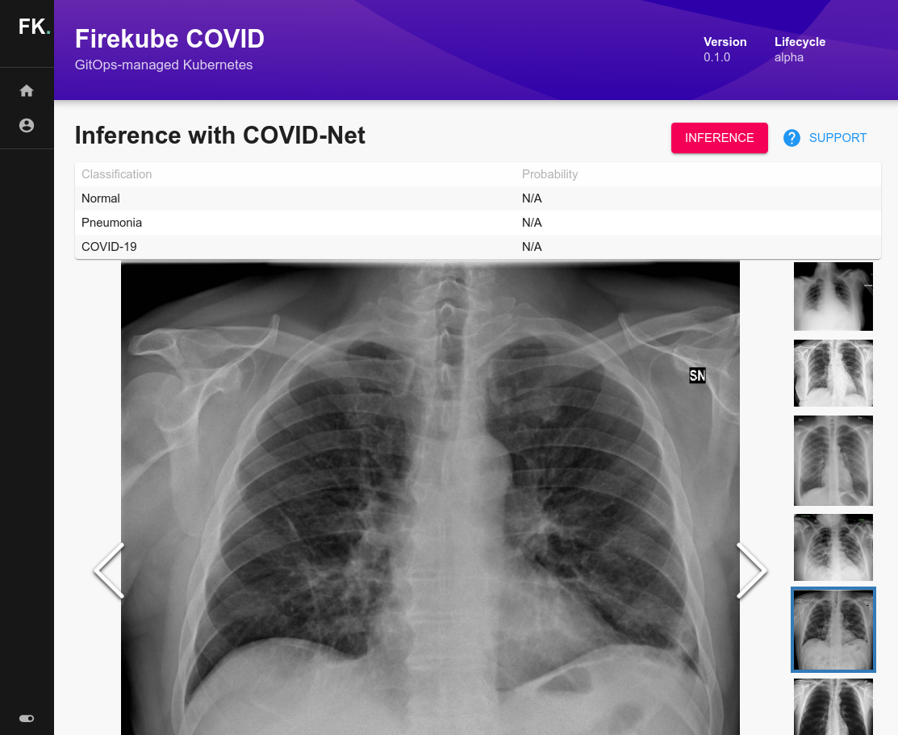

One of the great things about the open source community is once you put your work out there, you really never know where it might end up. That’s certainly the case here.

<!-- prettier-ignore -->
{/* truncate */}

When Weaveworks decided to build an X-ray diagnostics app to help fight COVID-19, they pulled together a lot of different open source resources — from projects big and small, built by both familiar tech partners and some brand new ones, too.

At the heart of their app — called [fk-covid][] — there’s a TensorFlow-based deep neural network that was developed by researchers on the DarwinAI team and others in the COVID R&D community. To package that network up for doctors and software developers to use, the app combines open source tools from Google, AWS, Azure, MinIO, the CNCF, and Weaveworks’ own Firekube bundle for Kubernetes.

And the user interface for all of this? Weaveworks built a custom plugin using the Backstage framework.

“We chose Backstage as a modern UI toolkit that we knew would work with Kubernetes apps,” said Alexis Richardson, CEO of Weaveworks. “We were also experimenting with Backstage for microservices and ML, so it was natural to try it here.”

Chanwit Kaewkasi, Weaveworks’ DX Engineer and a tech lead on the project, said, “Backstage offers very advanced plugin architecture which allows us to only focus on the plugin we're developing. Other things are taken care of by the framework.”

In other words, here’s Backstage doing what Backstage does best: unifying a bunch of technologies with a cohesive frontend, so that the whole thing is easier to build and easier to use.

Joining the fight against a global pandemic was not something the Backstage team at Spotify ever envisioned when we released our homegrown developer portal to the world back in March. But it’s a testament to the ingenuity (and serendipity) of the open source community that Backstage could be enlisted for such an unexpected use case.

We’re proud to see Backstage adopted as the UX layer for this meaningful cause. And we can’t wait to see what the open source community will build next.

To learn more about what fk-covid does, and how it works, jump on over to [the Weaveworks blog][] to hear it straight from the team that built it. It’s a great example of the possibilities that come from being a part of the open source community.

[fk-covid]: https://github.com/weaveworks/fk-covid
[the weaveworks blog]: https://www.weave.works/blog/firekube-covid-ml
