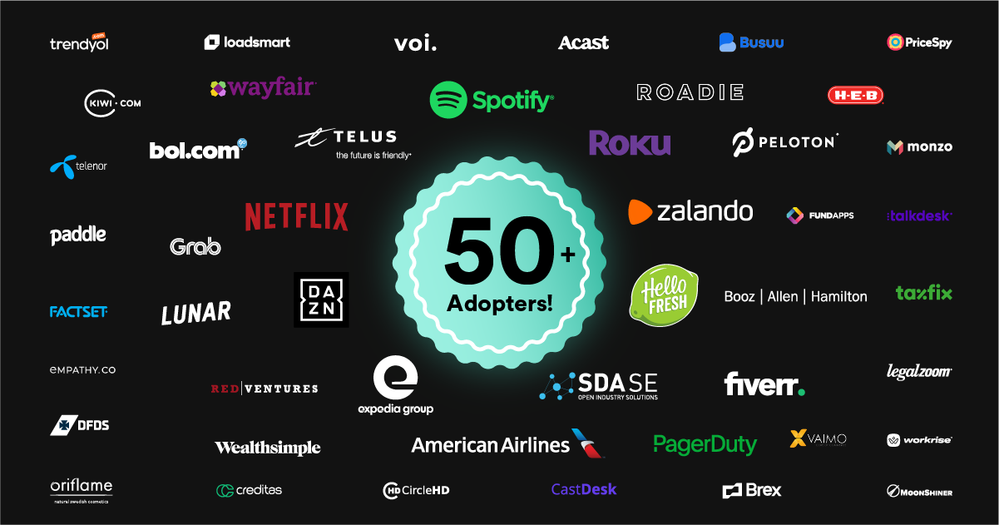
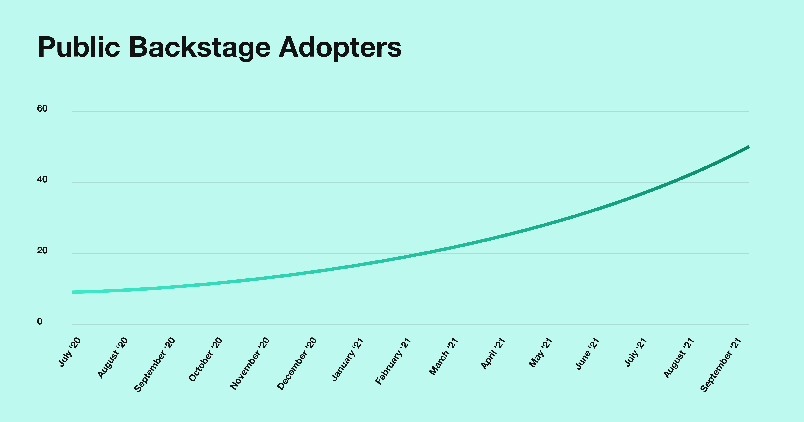

We’re excited to celebrate an important milestone for the Backstage community: 50+ [public adopters](https://github.com/backstage/backstage/blob/master/ADOPTERS.md)!

Before digging into why we believe this is so important, we want to send a huge “thank you” to all the Backstage adopters and contributors who have helped grow the Backstage community. First, to the publicly listed adopters as your visible support for the project excites others to learn more about Backstage. Second, to those non-listed adopters, many of whom still engage in the community via issues, comments, or code contributions. Thank you!

<!-- prettier-ignore -->
{/* truncate */}

## Why we care about public adopters

If you roll the clock back to early 2020 when Backstage was open sourced, we never could’ve imagined surpassing this milestone. It feels particularly big given that Backstage tends to be adopted by complex organizations with hundreds (if not thousands of) developers and thousands (if not tens of thousands) of software components.

We’ve also seen such diverse examples of Backstage in the wild. Adopters as varied as [American Airlines][am] and [Splunk][sp] have demoed their Backstage-built developer portals. We’ve seen digital-first companies like [Zalando][za] and [DAZN][da] share their journey from proof-of-concept to in-production. And the developer experience team at [Expedia Group][ex] has been shared at multiple Community Sessions, detailing their adoption journey as well as contributing back with ideas for new features.

For the Backstage project, public adopters are important because they provide a wide variety of use cases, industries, and degrees of complexity (teams, number of services, etc.) that Backstage is able to support. In addition, a growing adopters list shows the project’s maturity and helps other organizations understand the benefits and make the decision to join the project and the community.

In other words, the more the public adopters list grows and becomes more diverse, the more the community will grow and provide contributions that benefit all adopters.

## Fifty is just the beginning

While we’re thrilled to celebrate this milestone, the public adopters list is just one metric we monitor in the overall health of the Backstage project. It definitely doesn’t tell the whole story! We’re seeing continued growth within the contributor community, PRs, and GitHub overall ratings as well. As fate would have it, we also recently reached 50+ plugins in the [Backstage Plugin Marketplace][plugins]!

## Join us!

If you are a Backstage enthusiast, please [join me][news] and the entire Backstage Team in celebrating this milestone. And if you are a Backstage adopter not already listed in the [GitHub page][gh], consider adding your name to better inform the community and participate in the project.

[am]: https://backstage.spotify.com/blog/adopter-spotlight/american-airlines-runway/
[sp]: https://backstage.spotify.com/blog/community-session/splunk-pink-phonebook/
[za]: https://youtu.be/6sg5uMCLxTA
[da]: https://medium.com/dazn-tech/developer-experience-dx-at-dazn-e6de9a0208d2
[ex]: https://backstage.spotify.com/blog/community-session/firehydrant-expedia-loblaw/
[plugins]: https://backstage.io/plugins
[news]: https://info.backstage.spotify.com/newsletter_subscribe
[gh]: https://github.com/backstage/backstage/blob/master/ADOPTERS.md
