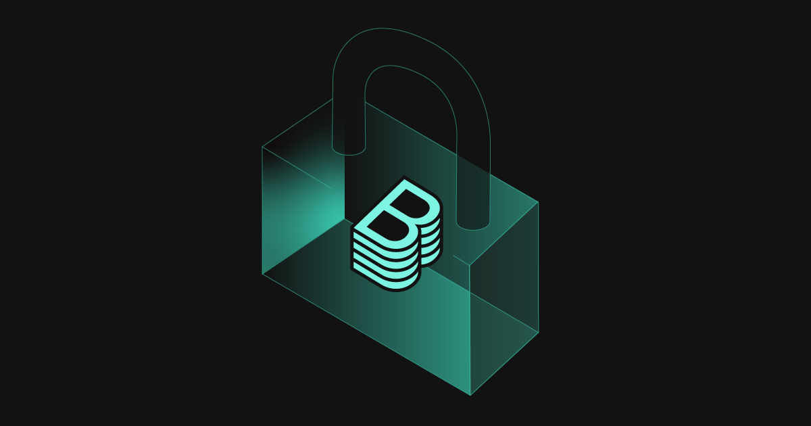

---
# prettier-ignore
title: Backstage Security Audit & Updates
author: Patrik Oldsberg, Spotify
authorURL: https://github.com/Rugvip
---

**TL;DR** Backstage’s security posture continues to mature! Today, we’re releasing a report from an independent security audit and the first version of the Backstage Threat Model.

As an [Incubating project](https://www.cncf.io/blog/2022/03/15/backstage-project-joins-the-cncf-incubator/) within the [Cloud Native Computing Foundation (CNCF)](https://www.cncf.io/), Backstage was fortunate enough to take advantage of a sponsored security audit. The [Open Source Technology Improvement Fund (OSTIF)](https://ostif.org/) sponsored the audit as part of its ongoing efforts to secure the open source software ecosystem, and the audit itself was performed by [X41 D-Sec](https://x41-dsec.de/). Our goal with the audit was to evaluate and improve Backstage’s security posture, focusing on the core Backstage framework and plugins.

<!-- prettier-ignore -->
{/* truncate */}

## Report Findings and Fixes

The security audit and improvements concluded earlier this month, on August 18th. The audit **findings** totalled two critical, two high, five medium, and three low severity vulnerabilities, alongside 15 side findings with no direct security impact. As of the [Backstage 1.5 release](https://backstage.io/docs/releases/v1.5.0), eight out of the 12 main findings and many of the side findings are fully remedied. If you are a few versions behind there’s no need to worry though, most fixes were included in the 1.3 release.

Out of the four findings that have yet to be fixed, three are related to rate limiting or internal DoS concerns. With the introduction of the Backstage Threat Model (more on that below), Backstage’s positioning states that this is outside the scope of the security concerns of Backstage. Rather, we trust internal users of Backstage to not intentionally sabotage the availability of the service. This is not to say that we will never aim to get these findings addressed, but we have pushed them to be potential future improvements as we focus our near-term efforts on improving the product in other ways.

The last outstanding finding is to build out the capabilities of our service-to-service auth system. This is an area where the audit identified a couple of missing pieces in our early version of the implementation. We have since closed the gap by introducing token expiration, and will continue to work on this as we open up for more complex and hardened deployment patterns through the [evolution of the backend system](https://github.com/backstage/backstage/issues/11611).

Another important finding was the potential for confusion and user impersonation due to most authentication providers having sign-in enabled by default. This finding reinforced our decision to switch sign-in to being disabled by default for all authentication providers, which was part of the [1.1 release](https://backstage.io/docs/releases/v1.1.0).

Perhaps the most important outcome of this audit is that it helped us focus our efforts to keep improving the security of Backstage. It identified priority areas in both implementation and documentation for us going forward. One particular area that was pointed out in a finding is the documentation around the security model of Backstage deployment. There have been several efforts to highlight this in documentation, but it is still not clear enough. What we’ve been lacking is documentation that is completely dedicated towards detailing the security concerns of Backstage. That is why in addition to publishing the security audit report, we are also introducing the [Backstage Threat Model](https://backstage.io/docs/overview/threat-model).

## Introducing the Backstage Threat Model

The existing Backstage documentation has many security concerns interwoven within its text, but to find them all, you need to spend a lot of time reading. We previously lacked a one-stop-shop for readers that are interested in the security model and concerns of Backstage. So, we are happy to introduce the [Backstage Threat Model](https://backstage.io/docs/overview/threat-model), which closes this gap. The Threat Model outlines key security considerations for operators, developers, and security researchers. It is a living document that will evolve and expand alongside the Backstage project.

The threat model document covers the trust model and roles involved in a typical Backstage setup, the responsibilities that fall on integrators of Backstage, and common configuration concerns across all Backstage projects. Beyond these three topics, it also dives deeper into a number of core features. The `auth`, `catalog`, `scaffolder`, and `techdocs` plugins are all covered separately with their individual security concerns.

We’d like to point out a few key parts in case you are in a rush. Be sure to familiarize yourself with the integrator's responsibility to protect the Backstage installation from unauthorized access. If you ingest organizational data into the catalog and use that to sign in users, you’ll also want to check out the first halves of the authentication and catalog sections.

## Links and References

- [Full Audit Report](assets/22-08-23/X41-Backstage-Audit-2022.pdf)
- [Backstage Security Policy](https://github.com/backstage/backstage/blob/master/SECURITY.md)

On behalf of the Backstage maintainers and community: thanks to the CNCF, OSTIF, and X41 D-Sec for the opportunity to improve the project.
