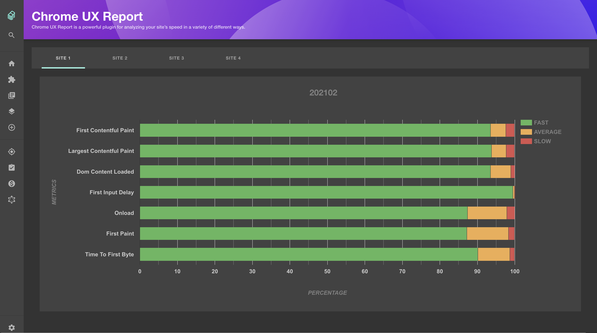
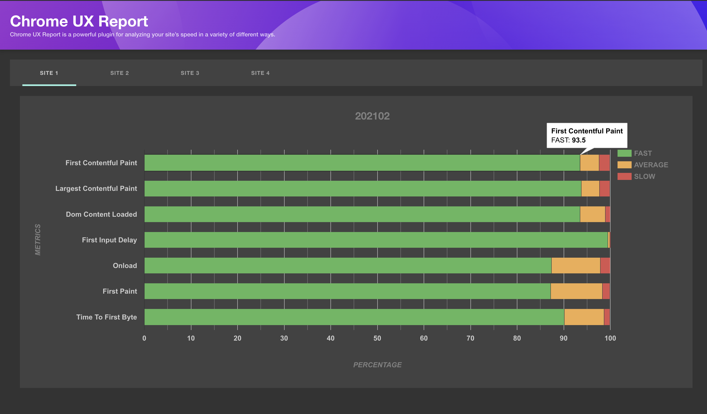

# Chrome UX Report

Welcome to the Chrome UX Report plugin!

## What is Chrome UX Report?

The Chrome User Experience Report is powered by real user measurement of key user experience metrics across the public web, aggregated from users who have opted-in to syncing their browsing history, have not set up a Sync passphrase, and have usage statistic reporting enabled. If you are curious of what is the metrics, you can go to [UX Metrics](#UXMetrics).

## Configuring the Plugin

You need to create a service account and get a JSON key from [Google Cloud Console](https://console.cloud.google.com)

**1. Set `chromeUXReport.projectId` config in your `app-config.yaml`**

Set `chromeUXReport.projectId` to project ID of your project in Google Cloud.

```yaml
chromeUXReport:
  projectId: 'example'
```

**2. Set `chromeUXReport.keyPath` config in your `app-config.yaml`**

You will get a JSON keyfile from Google Cloud. You can give this keyfile path with environmental variables. You can use the example

```yaml
chromeUXReport:
  projectId: 'example'
  keyPath:
    $env: GOOGLE_APPLICATION_CREDENTIALS
```

**3. Set the Origins that you want to track UX Metrics**

You can set the origins like example.

```yaml
chromeUXReport:
  projectId: 'example'
  keyPath:
    $env: GOOGLE_APPLICATION_CREDENTIALS
  origins:
    - site: 'Example'
      name: 'https://example.com'
```

**4. That's it!**

Your Backstage app is now ready to use Google Chrome UX Report Plugin! When you start the
backend of the app, you should be able to see
`'Plugin Chrome UX Report has started'`
in the logs. And then you can see these screens.

| List of audits                                                                 | Info about metric                                                                                   | Info about period                                                                                  |
| ------------------------------------------------------------------------------ | --------------------------------------------------------------------------------------------------- | -------------------------------------------------------------------------------------------------- |
|  |  |  |

## UXMetrics

Metrics provided by the public Chrome User Experience Report hosted on Google BigQuery are powered by standard web platform APIs exposed by modern browsers and aggregated to origin-resolution.

### First Paint

Defined by the Paint Timing API and available in Chrome M60+:

`First Paint reports the time when the browser first rendered after navigation. This excludes the default background paint, but includes non-default background paint. This is the first key moment developers care about in page load – when the browser has started to render the page.`

### First Contentful Paint

Defined by the Paint Timing API and available in Chrome M60+:

`First Contentful Paint reports the time when the browser first rendered any text, image (including background images), non-white canvas or SVG. This includes text with pending webfonts. This is the first time users could start consuming page content.`

### DOM Content Loaded

Defined by the HTML specification:

`The DOMContentLoaded reports the time when the initial HTML document has been completely loaded and parsed, without waiting for stylesheets, images, and subframes to finish loading.`

### Onload

Defined by the HTML specification:

`“The load event is fired when the page and its dependent resources have finished loading.”`

### First Input Delay

`“First Input Delay (FID) is an important, user-centric metric for measuring load responsiveness because it quantifies the experience users feel when trying to interact with unresponsive pages—a low FID helps ensure that the page is usable.”`

### Largest Contentful Paint

`“Largest Contentful Paint (LCP) is an important, user-centric metric for measuring perceived load speed because it marks the point in the page load timeline when the page's main content has likely loaded—a fast LCP helps reassure the user that the page is useful.”`

### Cumulative Layout Shift

`“Cumulative Layout Shift (CLS) is an important, user-centric metric for measuring visual stability because it helps quantify how often users experience unexpected layout shifts—a low CLS helps ensure that the page is delightful.”`

### Time to First Byte

`“Time to first byte (TTFB) is a measurement used as an indication of the responsiveness of a webserver or other network resource. TTFB measures the duration from the user or client making an HTTP request to the first byte of the page being received by the client's browser. This time is made up of the socket connection time, the time taken to send the HTTP request, and the time taken to get the first byte of the page.”`
