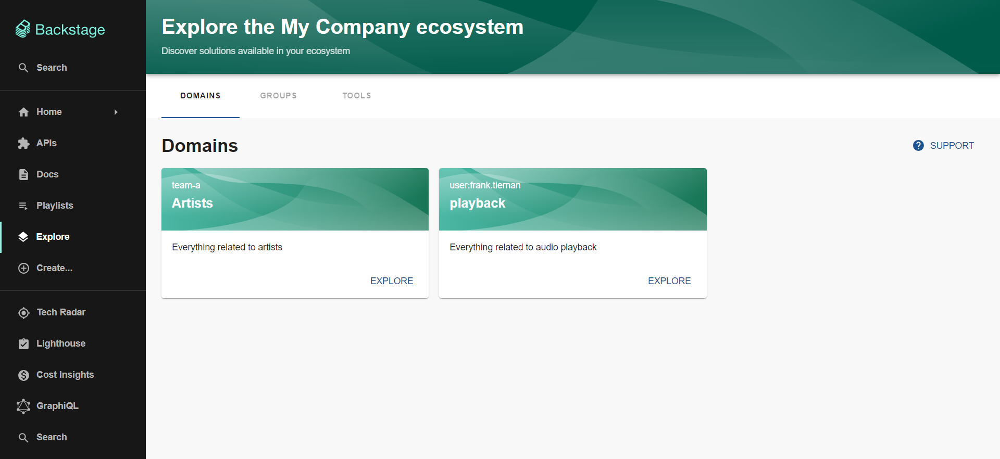
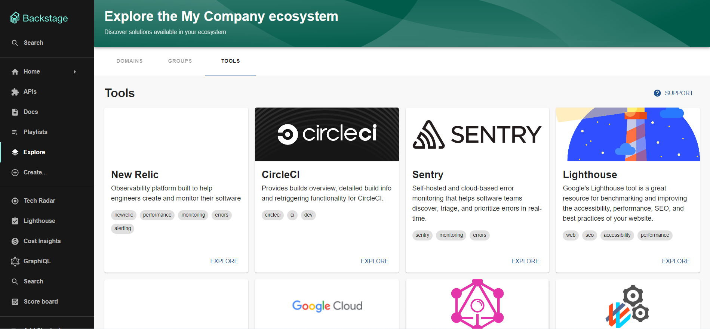

# explore

Welcome to the explore plugin!

This plugin helps to visualize the top level entities like domains, groups and tools in your ecosystem.

## Setup

The following sections will help you get the Explore plugin setup and running.

### Backend

You need to setup the
[Explore backend plugin](https://github.com/backstage/backstage/tree/master/plugins/explore-backend)
before you move forward with any of these steps if you haven't already.

### Installation

Install this plugin:

```bash
# From your Backstage root directory
yarn --cwd packages/app add @backstage/plugin-explore
```

### Add the plugin to your `packages/app`

Add the root page that the playlist plugin provides to your app. You can choose
any path for the route, but we recommend the following:

```diff
// packages/app/src/App.tsx
+ import { ExplorePage } from '@backstage/plugin-explore';

...

<FlatRoutes>
  <Route path="/catalog" element={<CatalogIndexPage />} />
  <Route path="/catalog/:namespace/:kind/:name" element={<CatalogEntityPage />}>
    {entityPage}
  </Route>
+  <Route path="/explore" element={<ExplorePage />} />
  ...
</FlatRoutes>
```

You may also want to add a link to the playlist page to your application
sidebar:

```diff
// packages/app/src/components/Root/Root.tsx
+import LayersIcon from '@material-ui/icons/Layers';

export const Root = ({ children }: PropsWithChildren<{}>) => (
  <SidebarPage>
    <Sidebar>
+      <SidebarItem icon={LayersIcon} to="explore" text="Explore" />
      ...
    </Sidebar>
```

### Use search result list item for Explore Tools

When you have your `packages/app/src/components/search/SearchPage.tsx` file
ready to make modifications, add the following code snippet to add the
`ToolSearchResultListItem` when the type of the search results are
`tool`.

```diff
+import { ToolSearchResultListItem } from '@backstage/plugin-explore';
+import BuildIcon from '@material-ui/icons/Build';

const SearchPage = () => {
 ...
  <SearchResult>
    {({ results }) => (
      <List>
        {results.map(({ type, document, highlight, rank }) => {
          switch (type) {
            ...
+            case 'tools':
+              return (
+                <ToolSearchResultListItem
+                  icon={<BuildIcon />}
+                  key={document.location}
+                  result={document}
+                  highlight={highlight}
+                  rank={rank}
+                />
+              );
          }
        })}
      </List>
    )}
    ...
  </SearchResult>
...
```

## Customization

Create a custom explore page in
`packages/app/src/components/explore/ExplorePage.tsx`.

```tsx
import {
  CatalogKindExploreContent,
  ExploreLayout,
} from '@backstage/plugin-explore';
import React from 'react';
import { InnerSourceExploreContent } from './InnerSourceExploreContent';

export const ExplorePage = () => {
  return (
    <ExploreLayout
      title="Explore the ACME corp ecosystem"
      subtitle="Browse our ecosystem"
    >
      <ExploreLayout.Route path="domains" title="Domains">
        <CatalogKindExploreContent kind="domain" />
      </ExploreLayout.Route>
      <ExploreLayout.Route path="systems" title="Systems">
        <CatalogKindExploreContent kind="system" />
      </ExploreLayout.Route>
      <ExploreLayout.Route path="inner-source" title="InnerSource">
        <InnerSourceExploreContent />
      </ExploreLayout.Route>
    </ExploreLayout>
  );
};

export const explorePage = <ExplorePage />;
```

Now register the new explore page in `packages/app/src/App.tsx`.

```diff
+import { explorePage } from './components/explore/ExplorePage';

const routes = (
  <FlatRoutes>
-    <Route path="/explore" element={<ExplorePage />} />
+    <Route path="/explore" element={<ExplorePage />}>
+      {explorePage}
+    </Route>
  </FlatRoutes>
);
```

## Features

### Explore Domains



### Explore Groups


### Explore Tools


